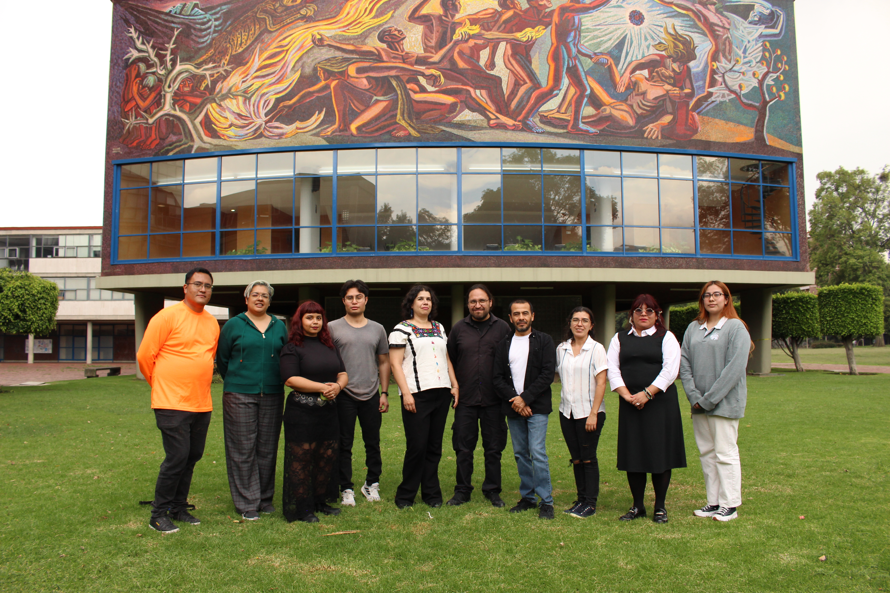

<!-- Hero Section -->
<a href="#/docs/proyectos" class="hero-section">
  

    
    

      <h1>LENTI</h1>
      
Laboratorio de Estudios sobre Nuevas Tecnologas e Innovación. Investigación interdisciplinaria para el futuro digital.

    

  

  
Explorar Proyectos

</a>

<!-- Novedades -->
## Novedades y Destacados

<csv-loader src="data/destacados.csv" category="Todos">
    
</csv-loader>

&nbsp;

<!-- Logos de instituciones Participantes -->
## Instituciones Participantes

    
    
    

<!-- Logos de fuentes de financiamiento -->
## Apoyo y Financiamiento

    

<!-- Grid de Navegación -->
## Descubre nuestro trabajo

<vue-mount>
    
</vue-mount>

